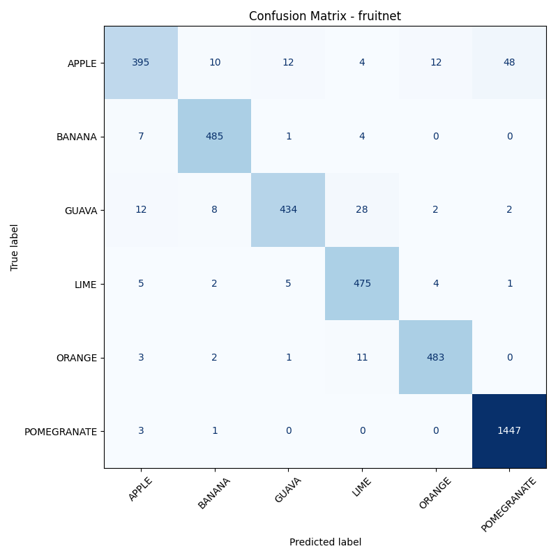
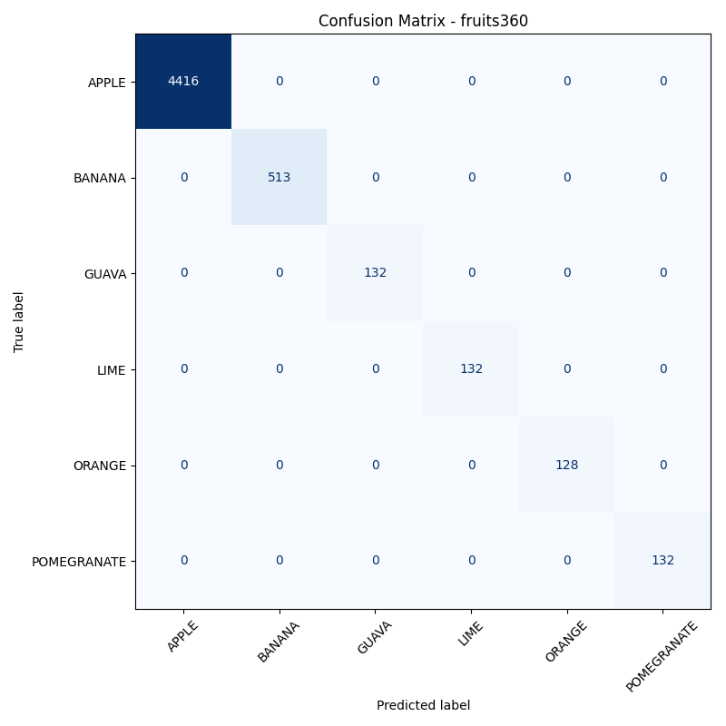

# 🍎 Fruit Classification with CNNs (FruitNet vs Fruits-360)

This project builds and compares two Convolutional Neural Network (CNN) image classifiers trained on **two different fruit datasets**: **FruitNet** and **Fruits-360**.

The goal is not just high accuracy, but to explore **dataset bias, generalisation, and real-world behaviour**, including how models respond to **out-of-distribution (OOD)** inputs in a live webcam setting.

---

## 📌 Project Highlights

- End-to-end computer vision pipeline in **PyTorch**
- Two separate models trained on different datasets
- Cleaned and standardised datasets for fair comparison
- Real-time **webcam demo with bounding box (ROI)**
- Explicit handling of **unknown / unseen fruits**
- Live confidence-based predictions
- Clear, reproducible project structure

---

## 🧠 Datasets

Two datasets are used, cleaned, and aligned to the **same six fruit classes**:

- Apple  
- Banana  
- Guava  
- Lime  
- Orange  
- Pomegranate  

### FruitNet
- Real-world images
- Significant background variation
- Larger visual diversity
- More challenging classification task

### Fruits-360
- Controlled lighting and background
- Object-centred images
- Easier classification task
- Higher risk of overfitting and dataset bias

Each dataset is trained **independently**, producing two separate models.

---

## 📚 Dataset Sources

- **FruitNet**  
  Source: [https://www.kaggle.com/datasets/shashwatwork/fruitnet-indian-fruits-dataset-with-quality](https://www.kaggle.com/datasets/shashwatwork/fruitnet-indian-fruits-dataset-with-quality)  
  Notes: Real-world images with variable backgrounds, diverse conditions.

- **Fruits-360**  
  Source: [https://www.kaggle.com/datasets/moltean/fruits](https://www.kaggle.com/datasets/moltean/fruits)  
  Notes: Controlled images with centered objects and consistent lighting.

> Both datasets were cleaned and aligned to a common set of six fruit classes for fair comparison.

---

## 🧪 Dataset Statistics

After cleaning and alignment:

| Dataset    | Total Images |
|-----------|--------------|
FruitNet    | 19,526 |
Fruits-360 | 27,246 |

Class distributions differ significantly, which is intentionally preserved to reflect real-world conditions.

---

## 🏗️ Project Structure

```
fruit-classifier/
├── assets/         # Demo GIFs / images
├── data/
│   ├── fruitnet/
│   └── fruits360/
├── results/        # Saved model weights and confusion matrices
├── scripts/
│   ├── data_sanity_check.py
│   ├── setup_path.py
│   ├── test_dataset.py
│   ├── test_split.py
│   ├── test_train.py
│   └── webcam_demo.py
├── src/
│   ├── evaluate_model.py
│   ├── train_model.py
│   ├── data/
│   │   ├── dataset.py
│   │   ├── pytorch_dataset.py
│   │   ├── split.py
│   │   └── transforms.py
│   └── utils/
│       └── constants.py
└── README.md
```

---

## 🧠 Model Architecture

A simple CNN implemented using **PyTorch**, consisting of:

- Convolution + ReLU layers
- Max pooling
- Fully connected layers
- Softmax output over 6 classes

The architecture is intentionally kept lightweight to:
- Enable real-time webcam inference
- Focus on dataset effects rather than model complexity

---

## 🚀 Training Results

### FruitNet Model

| Epoch | Train Acc | Val Acc |
|-------|-----------|---------|
| 1     | 78.2%     | 87.9%   |
| 5     | 96.7%     | 96.4%   |

### Fruits-360 Model

| Epoch | Train Acc | Val Acc |
|-------|-----------|---------|
| 1     | 97.1%     | 98.1%   |
| 5     | 99.7%     | 99.8%   |


> ⚠️ The extremely high accuracy on Fruits-360 highlights how **controlled datasets can inflate performance** and fail to reflect real-world complexity.

---

## 📊 Model Evaluation

### Confusion Matrices

The following confusion matrices show per-class performance for each trained model. Rows represent true labels and columns represent predicted labels.

#### FruitNet Model



This matrix reflects performance on a real-world dataset with higher background variability and lighting differences, making classification more challenging.

#### Fruits-360 Model



The near-perfect diagonal highlights how controlled datasets can significantly inflate performance metrics and mask generalisation issues.

---

## 🔍 Interpretation

- FruitNet shows minor confusion between visually similar fruits, reflecting realistic ambiguity  
- Fruits-360 achieves near-perfect separation due to consistent backgrounds and object centering  
- This contrast reinforces why dataset choice matters as much as model architecture  

---

## 🧠 Why This Matters

Confusion matrices provide insights that overall accuracy alone cannot:

- Identify systematic misclassifications  
- Reveal dataset bias  
- Guide future improvements such as data augmentation or dataset expansion  

---

## 📷 Live Webcam Demo


Two trained models are loaded simultaneously and evaluated live using a webcam feed.

A fixed **Region of Interest (ROI)** bounding box is used to simulate a real deployment scenario, where the system must decide *what* is inside a predefined frame.

### Key Features
- Real-time predictions
- Confidence scores
- Bounding box overlay
- Dataset-to-dataset behaviour comparison

---

## ❓ OOD Behaviour

A **kiwi** is intentionally shown during the live webcam demo to test how each model behaves on an unseen class.

### FruitNet Model

The FruitNet-trained model shows **uncertainty** when presented with a kiwi:
- Predictions flicker between known fruit classes
- Confidence scores frequently fall **below the decision threshold**
- The model often outputs an “unsure” state

This behaviour indicates some degree of **uncertainty awareness**, likely due to greater visual diversity and background variation in the training data.

### Fruits-360 Model

In contrast, the Fruits-360-trained model behaves very differently:
- The kiwi is confidently misclassified as **banana**
- Confidence scores remain extremely high (often **~1.00**)
- The model does **not** drop below the uncertainty threshold or flicker

This demonstrates **severe overconfidence** on out-of-distribution inputs.

### Comparison Table

| Model         | OOD Behaviour (kiwi)           | Confidence      | Notes                                   |
|---------------|--------------------------------|----------------|----------------------------------------|
| FruitNet      | Flickers between fruit labels | Mostly < threshold | Shows realistic uncertainty            |
| Fruits-360    | Boldly labels as banana       | ~1.00           | Overconfident, ignores OOD uncertainty |

### 🧠 Interpretation

- Fruits-360 produces inflated confidence due to its highly controlled training data
- The model learns strong spurious correlations (shape, colour, lighting)
- High accuracy on test data does **not** imply calibrated confidence
- FruitNet exhibits more realistic uncertainty despite lower peak accuracy

### 🚨 Why This Matters in Practice

Overconfident models on unseen inputs are dangerous in real-world systems:
- They silently produce incorrect predictions
- Confidence-based safeguards fail
- Downstream systems cannot detect errors

This experiment highlights why:
- Dataset diversity matters
- Confidence calibration is critical
- OOD behaviour must be evaluated explicitly, not assumed

### 🔮 Potential Improvements

- Introduce confidence calibration (e.g. temperature scaling)
- Add an explicit “unknown” class
- Use entropy-based or threshold-based OOD detection
- Train on more diverse background data


## 🧠 Key Learnings

- Dataset quality matters more than model complexity
- High accuracy does not guarantee real-world robustness
- Controlled datasets can hide generalisation issues
- OOD inputs must be explicitly considered
- Confidence scores are critical for deployment

---

## 🔮 Future Work

- Train a CNN **from scratch** (no PyTorch modules) and compare performance
- Introduce data augmentation and measure robustness gains
- Fine-tune a pretrained model (e.g. ResNet18)
- Experiment with automatic OOD detection thresholds

---

## 🛠️ Tech Stack

- Python
- PyTorch
- torchvision
- OpenCV
- NumPy

---

## 👤 Author

**Sam Wakiel**   

---

